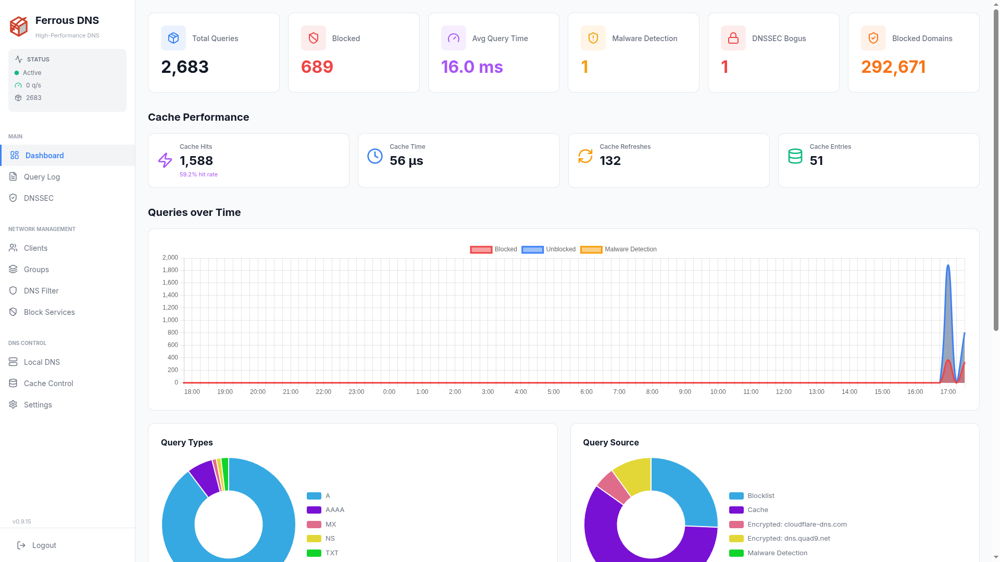
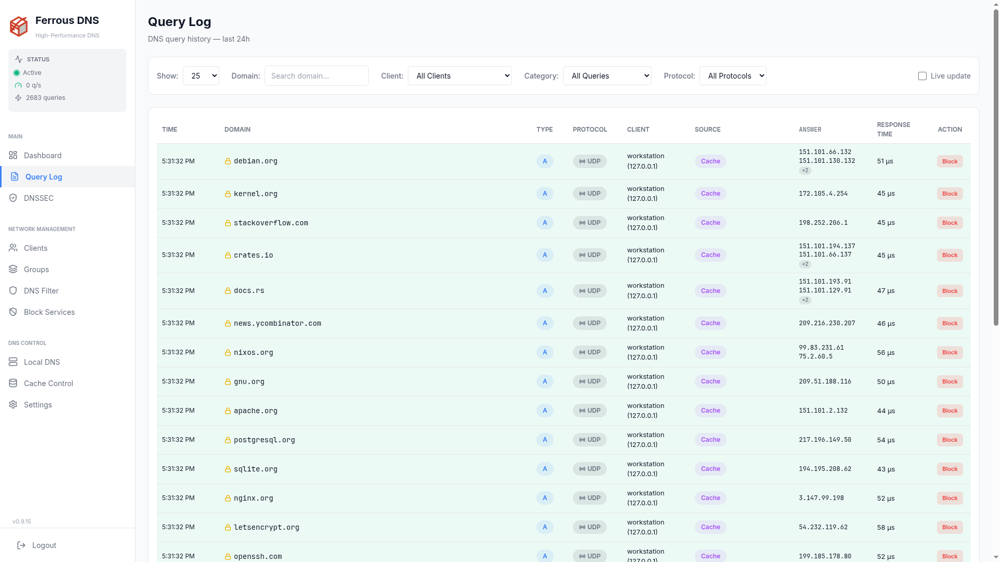
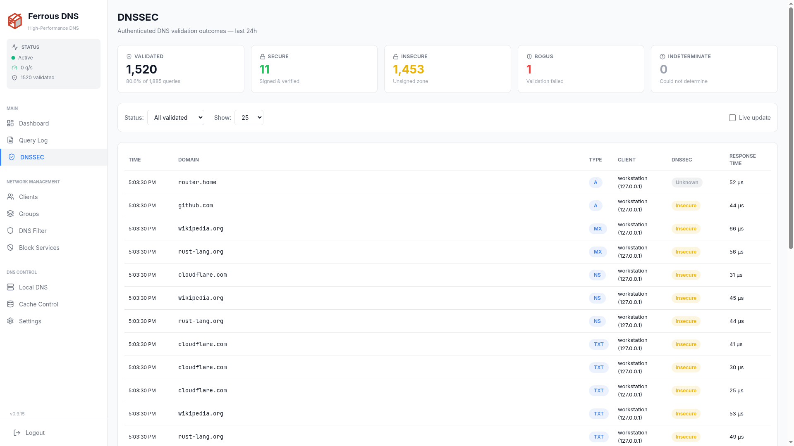
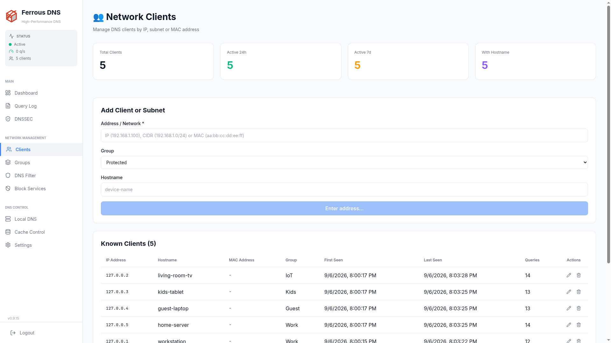
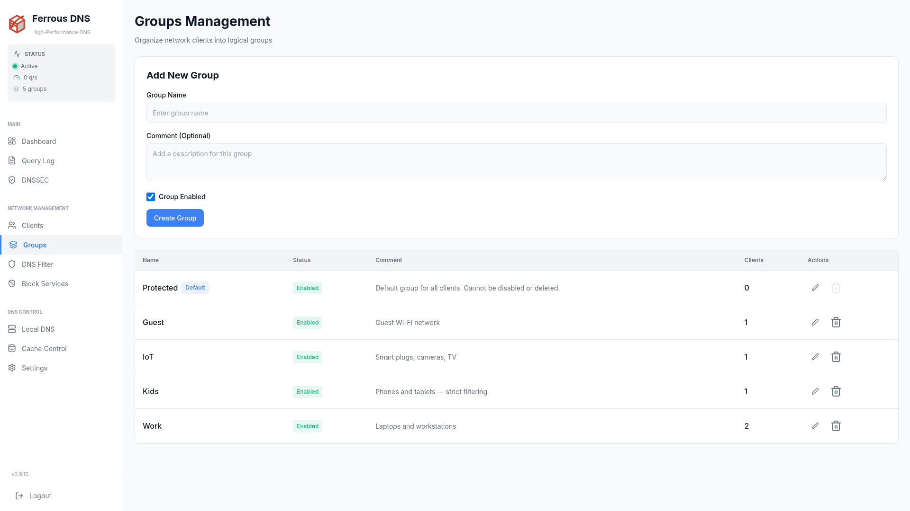
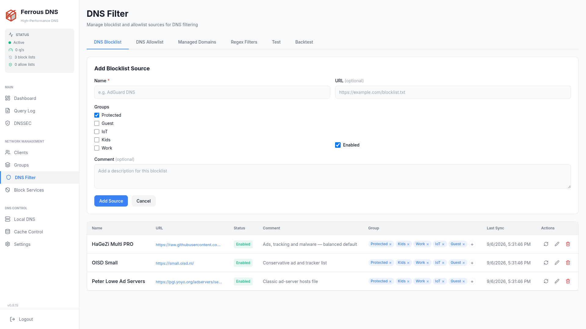
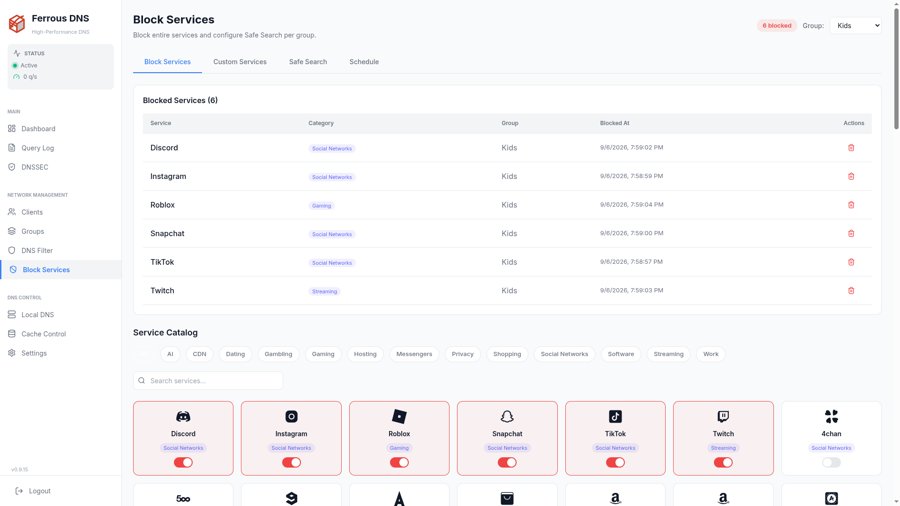
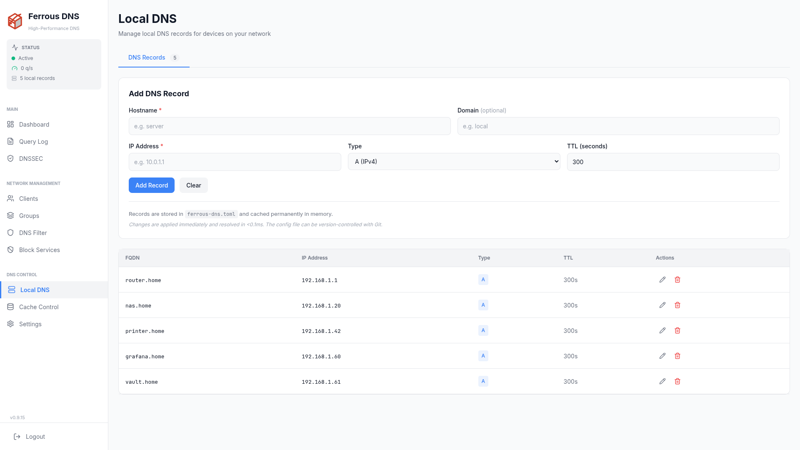
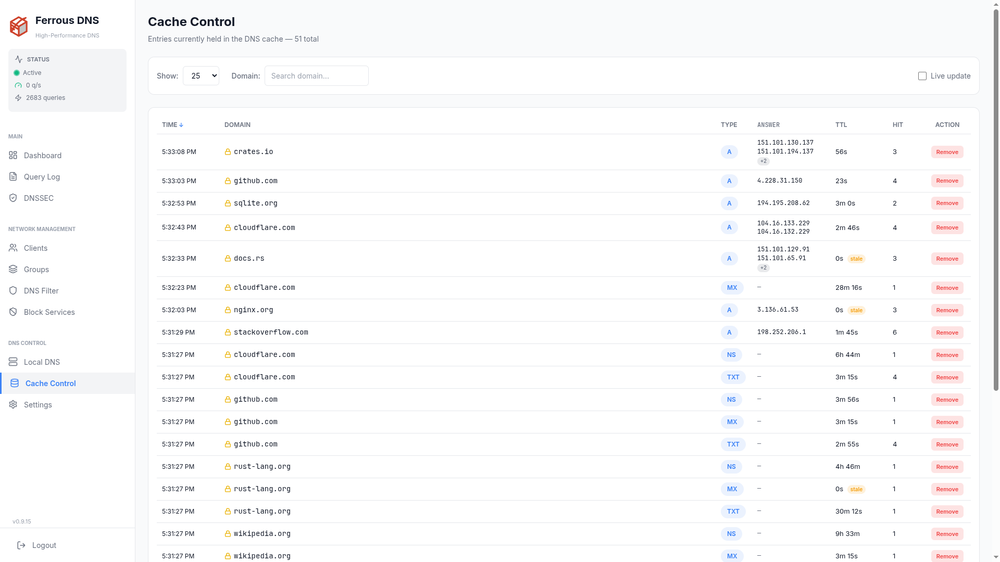
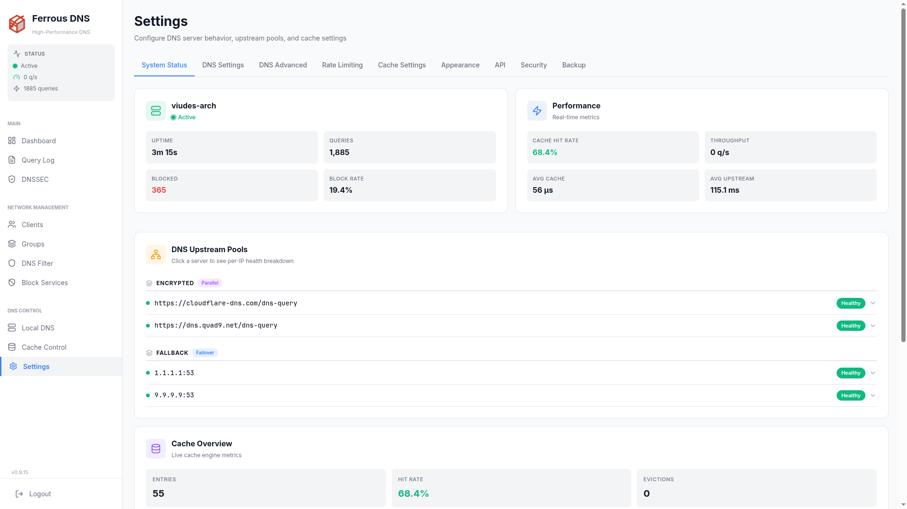

# Web Dashboard

Ferrous DNS includes a built-in web dashboard for monitoring and managing your DNS server. It runs on the same port as the REST API (`web_port`, default `8080`) with no additional setup required.

---

## Accessing the Dashboard

Open your browser and navigate to:

```text
http://<your-server-ip>:8080
```

The dashboard is a single-page application built with **HTMX + Alpine.js + TailwindCSS** and compiled into the server binary — no external dependencies, no Node.js, no build step.

---

## Dashboard Pages

### Main Dashboard

The landing page shows a real-time overview of your DNS server:

- **Query rate** — live queries per second with color-coded indicator
- **Total queries** — cumulative count since last restart
- **Blocked queries** — total blocked with percentage
- **Rate limited queries** — count of queries throttled by the rate limiter
- **Block rate** — ratio of blocked to total queries
- **Query timeline** — visual graph of query volume over time (allowed, blocked, and rate-limited)
- **Top queried domains** — most popular DNS lookups
- **Top blocked domains** — most frequently blocked domains
- **Top clients** — most active clients by query count
- **Block filter stats** — blocklist size, total entries



### Queries

Live query log with:

- Domain name, query type (A, AAAA, CNAME, MX, etc.)
- Client IP and hostname
- Transport the client used to reach the resolver (UDP, TCP, DoT, DoH, DoQ)
- Response status (allowed, blocked, cached, rate-limited)
- Response time
- Filter by category: allowed, blocked, rate-limited
- Filter by protocol: UDP, TCP, DoT, DoH, DoQ
- **Quick actions**: Block or Allow a domain with one click



### DNSSEC

Validation outcomes for the last 24 hours, summarised and then listed per query:

- **Validated** — how many answers went through validation, and what share of all queries that is
- **Secure** — signed and cryptographically verified
- **Insecure** — the zone is unsigned, so there was nothing to verify
- **Bogus** — validation failed; under `dnssec_mode = "Strict"` these answers become SERVFAIL
- **Indeterminate** — the chain of trust could not be resolved either way
- Filter the listing by status, and follow it live with **Live update**



### Clients

- Auto-detected clients with IP, MAC address, and hostname
- Query count and block rate per client
- Group assignment
- Manual client creation
- Client subnet rules (auto-assign by CIDR range)



### Groups

- Create and manage client groups (Kids, Work, IoT, Guest)
- Assign clients to groups
- Each group can have independent blocking policies



### DNS Filter

Multi-tab filtering management:

- **Blocklist Sources** — add, enable/disable and remove external blocklist URLs; each row carries a refresh action that re-downloads it on demand
- **Whitelist Sources** — add external allowlist URLs
- **Managed Domains** — individual block/allow domains
- **Regex Filters** — pattern-based blocking rules

Both source tabs carry a **Last Sync** column recording when each URL was last
downloaded successfully. An empty value means the source has never been fetched
without error — which is how a dead URL becomes visible, since a failed download
is otherwise only written to the log.



### Block Services

- **Service Catalog** — 1-click block/unblock of pre-defined service categories (Social Media, Ads, Tracking, Gambling, Adult Content)
- **Custom Services** — define your own service categories with domain lists
- **Safe Search** — enforce safe search per group (Google, Bing, YouTube, DuckDuckGo, Yandex, Brave, Ecosia)
- **Schedule Profiles** — time-based blocking with day/time slot management



### Local DNS

- Manage static A/AAAA records
- Automatic PTR generation from A records
- Conditional forwarding configuration



### Cache Control

- Lists the entries currently held in the DNS cache: insertion time, remaining TTL, domain (with DNSSEC validation status), record type, answer, and hit count
- Search by domain substring
- Sort by clicking any column header (repeat click reverses the direction)
- Paginated listing with a configurable page size
- **Remove** — drop an individual entry from the cache



### Settings

- **System Status** — hostname, kernel, CPU load, memory usage, uptime
- **Upstream Health** — per-pool and per-server health status with latency metrics
- **Cache Overview** — entries, hit rate, evictions, compactions, optimistic refreshes
- **DNS Configuration** — upstream pools, strategies, DNSSEC, cache settings
- **Rate Limiting** — enable/disable rate limiting, configure QPS, burst, whitelist, slip ratio, dry-run mode, TCP/DoT connection limits
- **DNS Settings** — non-FQDN blocking, private PTR blocking, local domain
- **API Key** — generate, save, or remove the API key
- **Dashboard Session Key** — authenticate the dashboard for API key-protected servers
- **Pi-hole Compatibility** — toggle Pi-hole v6 API mode



---

## Dark Mode

The dashboard supports light and dark themes. Toggle via the theme button in the top navigation bar. The preference is saved in `localStorage`.

---

## Real-Time Updates

The dashboard polls the server at regular intervals:

| Data | Interval |
|:-----|:---------|
| Query rate | 1 second |
| Health status, stats, system info | 10 seconds |

Polling pauses automatically when the browser tab is not visible (via the Page Visibility API) to reduce unnecessary network and server load.

---

## API Key Authentication

When an API key is configured on the server, the dashboard needs the key to perform write operations (saving settings, managing blocklists, etc.).

1. Go to **Settings > Dashboard Session Key**
2. Enter your API key
3. Click **Save**

The key is stored in `localStorage` and sent automatically with all API requests via the `X-Api-Key` header.

!!! tip
    When you generate and save a new API key via the Settings page, the dashboard automatically stores it as the session key.

---

## Pi-hole Compatibility Mode

When `pihole_compat = true`, the dashboard continues to work normally. The frontend auto-detects the correct API prefix (`/ferrous/api` instead of `/api`) via the `/ferrous-config.js` endpoint.

Third-party Pi-hole dashboards can connect to `/api/*` using the Pi-hole v6 session-based authentication.
