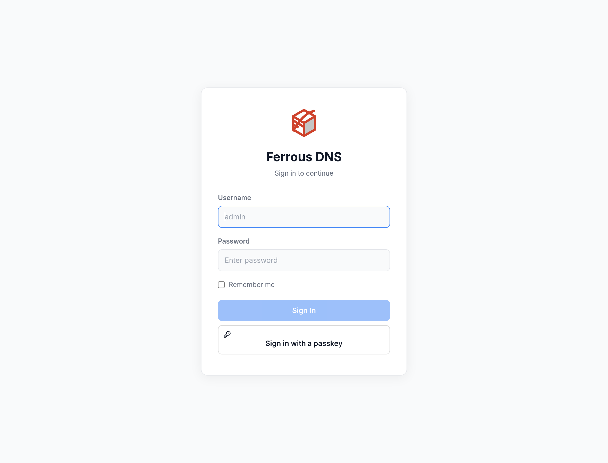
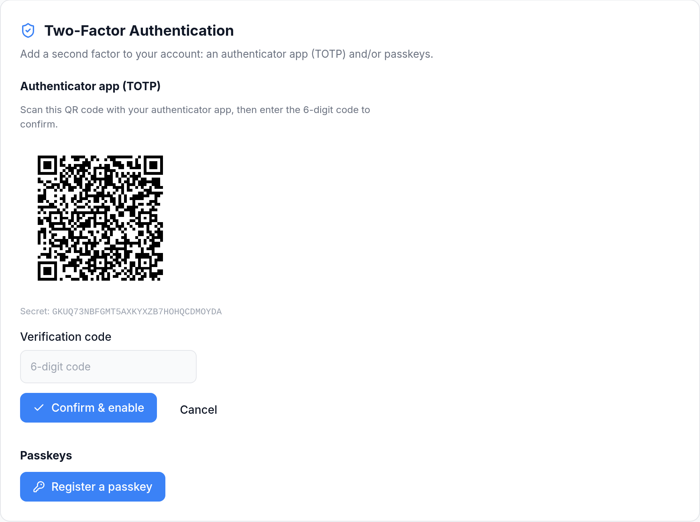
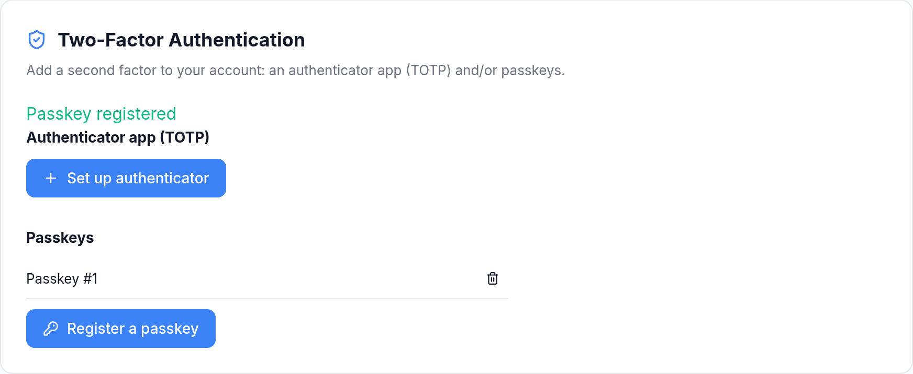

# Two-Factor Authentication

Ferrous DNS protects the dashboard and REST API with a second authentication factor. Two independent methods are supported and can be enabled together:

- **Authenticator app (TOTP)** — time-based one-time codes (RFC 6238), compatible with Google Authenticator, Aegis, 1Password, and similar apps.
- **Passkeys (WebAuthn)** — hardware security keys and platform authenticators (Touch ID, Windows Hello, Android). Passkeys can act as a second factor *or* replace the password entirely for **passwordless login**.

Both are managed per user under **Settings → Security**, and require [authentication](../features/security.md) to be enabled (`[auth] enabled = true`).

---

## Signing in

The login screen accepts your username and password. When passkeys are available on the device, a **Sign in with a passkey** button offers usernameless, passwordless login — no password required at all.



When an account has TOTP or passkeys enrolled, the password step is followed by a second-factor prompt (enter a 6-digit code, use a recovery code, or tap a passkey).

---

## Authenticator app (TOTP)

Under **Settings → Security → Two-Factor Authentication**, choose **Set up authenticator**. Ferrous DNS shows a QR code (and the raw secret, for manual entry). Scan it with your authenticator app, then enter the generated 6-digit code to confirm and enable.



On successful confirmation you receive a set of **one-time recovery codes** — store them somewhere safe. Each code lets you sign in once if you lose access to your authenticator. TOTP works on any deployment, including servers reached by bare IP over plain HTTP.

The issuer label shown by the authenticator app is configurable via `totp_issuer` in `[auth]` (default `"Ferrous DNS"`).

---

## Passkeys (WebAuthn)

Passkeys use public-key cryptography bound to your device or security key. From the same Security panel, choose **Register a passkey** and follow your browser/OS prompt. Registered passkeys are listed and can be removed individually.



### Requirements

Passkeys stay **inert until both `rp_id` and `rp_origin` are configured** under `[auth.webauthn]`, because WebAuthn requires a secure context:

```toml title="ferrous-dns.toml"
[auth.webauthn]
rp_id     = "dns.example.com"
rp_origin = "https://dns.example.com"
```

- `rp_origin` must be HTTPS — or `http://localhost` for local testing.
- `rp_origin` must exactly match the address the browser uses to reach the dashboard (scheme, host, and port).
- `rp_id` must be the registrable domain the origin belongs to.

A server reached only by bare IP over plain HTTP cannot use passkeys; those deployments rely on TOTP. See the [`[auth.webauthn]` reference](../configuration/ferrous-dns-toml.md#auth-webauthn) for details.

### Passwordless (discoverable) login

If your passkey is a **resident credential** (the default for platform authenticators and modern security keys), you can log in with the passkey alone — no username, no password. Click **Sign in with a passkey** on the login screen; the browser resolves your account from the credential and issues a session directly.

Disabled accounts cannot sign in this way even with a registered passkey — the account-disabled check is enforced on every login path.

---

## Recovery

- **Lost authenticator:** use one of the one-time recovery codes issued when you enabled TOTP.
- **Lost all factors:** the TOML admin account is always recoverable by editing the config file. Clear `[auth.admin] password_hash` and restart to re-run the setup wizard — see [`[auth.admin]`](../configuration/ferrous-dns-toml.md#auth-admin).

---

## Configuration reference

| Setting | Section | Purpose |
|:--------|:--------|:--------|
| `totp_issuer` | `[auth]` | Issuer label shown in authenticator apps |
| `mfa_challenge_ttl_secs` | `[auth]` | Lifetime of a pending second-factor / passkey ceremony (default 300s) |
| `rp_id` | `[auth.webauthn]` | Relying-party ID (registrable domain) |
| `rp_origin` | `[auth.webauthn]` | Relying-party origin URL (must match the browser address) |

See the [full `[auth]` reference](../configuration/ferrous-dns-toml.md#auth) and [Security](../features/security.md).
